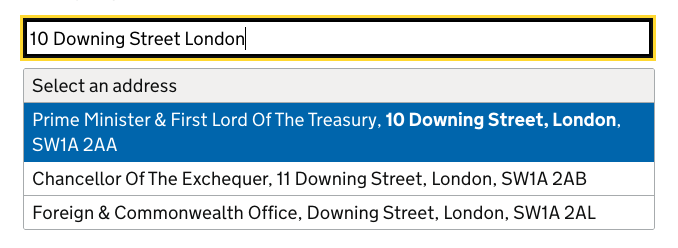
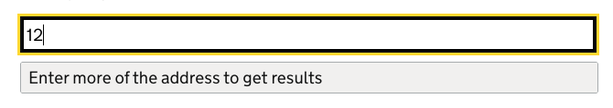
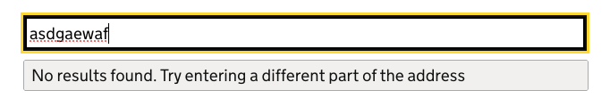
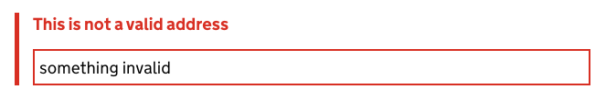
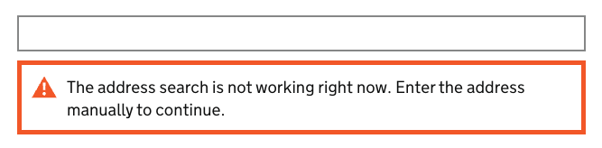

[< Back](../../../README.md)
---

# Address Autosuggest

An accessible address autosuggest component that provides matching addresses as the user types into the input box.
Address results provided by the [OSPlaces API](https://docs.os.uk/os-apis/accessing-os-apis/os-places-api/technical-specification).
Client side javascript based heavily on Based on ONSDigital's [address-input](https://github.com/ONSdigital/design-system/blob/main/src/components/address-input).

## Output

Displaying results:



A minimum of 3 characters required:



Indicates when no results found:



Displays a validation error (user has typed but not selected an option):



Indicates when there is an error contacting the [OSPlaces API](https://docs.os.uk/os-apis/accessing-os-apis/os-places-api/technical-specification):



## Usage

Please first follow the library setup instructions [here](../../../README.md#installation).

### API
This library supports you in setting up an API endpoint and client to query the [OSPlaces API](https://docs.os.uk/os-apis/accessing-os-apis/os-places-api/technical-specification).
You will need to set up an OS Data Hub account [here](https://osdatahub.os.uk/plans) (please contact #connect-dps for 
support in setting this up) and get an API key. 

A basic example to set up the endpoint is:

```typescript
  import { ApiConfig } from '@ministryofjustice/hmpps-rest-client'
  import { OsPlacesApiClient, OsPlacesAddressService } from '@ministryofjustice/hmpps-connect-dps-shared-items'
  import logger from './logger' // import the logger 

  // normally found in a config.ts file...
  const osPlacesApiConfig: ApiConfig & { apiKey: string } = {
    url: 'https://api.os.uk/search/places/v1',
    apiKey: 'THE-API-KEY',
    ... and timeout config
  }
  
  // normally set up in a data/index.ts file...
  const osPlacesApiClient = new OsPlacesApiClient(logger, osPlacesApiConfig)

  // normally set up in a services/index.ts file...
  const osPlacesAddressService = new OsPlacesAddressService(logger, osPlacesApiClient) 

  ... router initialisation

  // simple router setup:
  // the path can be customised, see below
  router.get('/api/addresses/find/:query', async (req: Request, res: Response) => {
    try {
      const results = await osPlacesAddressService.getAddressesMatchingQuery(req.params.query)
      res.json({ status: 200, results })
    } catch (error) {
      res.status(getErrorStatus(error)).json({ status: getErrorStatus(error), error: error.message })
    }
  })
```

the frontend javascript can then call this endpoint to retrieve the list of results to display in the UI.

### Nunjucks macro

To use the component in a nunjucks template:
```javascript
  

  ...

  {{ addressAutosuggest({
    value: 'some prepopulated input value, for instance after validation error',
    errorMessage: 'some error message, for instance after validation error',
    classes: 'some-custom-styling-class',
    findUrl: '/api/addresses/find'
  }) }}
```

<details>
  <summary>Nunjucks macro options</summary><br>
  <table>
    <tr>
      <th>Name</th>
      <th>Type</th>
      <th>Description</th>
    </tr>
    <tr>
      <td><b>classes</b></td>
      <td>string</td>
      <td>Classes to add to the component.</td>
    </tr>
    <tr>
      <td><b>errorMessage</b></td>
      <td>object</td>
      <td>Can be used to add an error message to the text input component. The error message component will not display 
        if you use a falsy value for <code>errorMessage</code>, for example <code>false</code> or <code>null</code>.
        <a href="https://design-system.service.gov.uk/components/error-message/#options-error-message-example">See macro
        options for errorMessage</a>.
      </td>
    </tr>
    <tr>
      <td><b>findUrl</b></td>
      <td>string</td>
      <td>The URL that the client side javascript should use to perform the find address query. Defaults to 
        <code>/api/addresses/find</code>
      </td>
    </tr>
    <tr>
      <td><b>value</b></td>
      <td>string</td>
      <td>Optional initial value of the input.</td>
    </tr>
  </table>
</details>

An example implementation can be found in the Prisoner Profile, the related PR is [here](https://github.com/ministryofjustice/hmpps-prisoner-profile/pull/1209).
