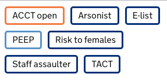

# Alert flags

Will output a div or anchor tag of alert flags styled based on the category of alert.

## Output



```html

<div class="alert-status alert-status--self-harm">
    ACCT open
</div>

or

<a href="/prisoner/xxxxxx/alerts" class="alert-status alert-status--self-harm">
  ACCT open
</a>
```


## Usage
```javascript
  
```

```javascript
  {{ alertFlag({
    alert: alertFlag,
    href: '/prisoner/xxxxxx/alerts',
    attributes: {
      'data-prisoner-number': prisonerNumber
    }
  }) }}
```

The `href` and `attributes` are optional. If `href` is provided, the alert flag will be rendered as an anchor tag. If `attributes` are provided, they will be added to the anchor tag or div as attributes.

The `alertFlag` argument can be obtained by passing in the prisoner's alerts to the `getAlertFlagLabelsForAlerts` method provided. E.g.

```javascript
  import dpsSharedItems from '@ministryofjustice/hmpps-connect-dps-shared-items'

  const alertFlagsForPrisoner = dpsSharedItems.alertFlags.getAlertFlagLabelsForAlerts(prisoner.alerts)
```
This expects the alerts to be in one of the three formats [shown in this file](../../src/alertFlags/types/Alert.ts) and returns a list of alerts that can be passed into the nunjucks macro.

E.g.

```javascript

    <li>
        {{ alertFlag({
            alert: alert
        }) }}
    </li>

```

If alerts of type `AlertsServiceAlert` are passed in to `dpsSharedItems.alertFlags.getAlertFlagLabelsForAlerts` and contain an `alertUuid` then these will be added to the `alertIds` array of the returned `AlertFlagLabel` which can be used by the frontend javascript to populate the popups. E.g.

```javascript

    <li>
      {{ alertFlag({
         alert: alert,
         href: "/prisoner/" + prisonerNumber + "/alerts/detail?ids=" + alert.alertIds | join('&ids='),
         attributes: {
            'data-prisoner-number': prisonerNumber
         }
      }) }}
    </li>

```
