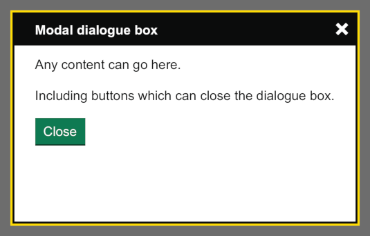

[< Back](../../../README.md)
---

# Modal dialogue box

Show a modal dialogue box with pre-rendered content or HTML loaded from a URL. Use sparingly.

## Output

An open dialogue box:



## Usage

If the content to be displayed is known at page-rendering time,
then it can be added to the dialogue box by calling the macro providing the content HTML:
```nunjucks



  <p>Pre-rendered modal content.</p>

```

To trigger the modal to open, add the `hmpps-modal__trigger-show` class to an element (such as a GOV.UK button component),
and reference the modal’s id in the `data-hmpps-modal-id` attribute:
```nunjucks
{{ govukButton({
  text: "Show modal",
  href: "/link-to-content",
  classes: "hmpps-modal__trigger-show",
  attributes: { "data-hmpps-modal-id": "modal1" }
}) }}
```
When using an anchor as the trigger, it’s good practice to link the `href` attribute to a page representing the same content.
This improves accessibility of the page and provides a fall back if javascript is disabled.

One modal may be triggered by multiple elements.

The contents can also be loaded from a URL. Add the URL to the `data-hmpps-modal-url` attribute on the triggering element:
```nunjucks
{{ hmppsModal({
  id: "modal2",
  title: "Modal dialogue box"
}) }}

{{ govukButton({
  text: "Load from URL",
  href: "/link-to-content",
  classes: "hmpps-modal__trigger-show",
  attributes: { "data-hmpps-modal-id": "modal2", "data-hmpps-modal-url": "/slow-modal-html" }
}) }}
```

Contents, whether pre-rendered or loaded from a URL, can contain elements which will
close the dialogue box when clicked. Add the `hmpps-modal__trigger-hide` class to any such element.

Modals can also be programmatically triggered in client-side code.
Find a model instance by id and call `show`, `load` or `hide` methods as necessary.
```javascript
const modal = Modal.getById('modal1')
modal?.show()
```

<details>
  <summary>Nunjucks macro options</summary><br>
  <table>
    <tr>
      <th scope="col">Name</th>
      <th scope="col">Type</th>
      <th scope="col">Description</th>
    </tr>
    <tr>
      <th scope="row">id</th>
      <td>string</td>
      <td>
        The id attribute added to the component’s wrapper element.
        This id is needed to lookup or trigger the modal to show.
      </td>
    </tr>
    <tr>
      <th scope="row">title</th>
      <td>string</td>
      <td>The dialogue box’s title.</td>
    </tr>
    <tr>
      <th scope="row">classes</th>
      <td>string (optional)</td>
      <td>Classes to add to the component’s container element.</td>
    </tr>
  </table>
</details>
