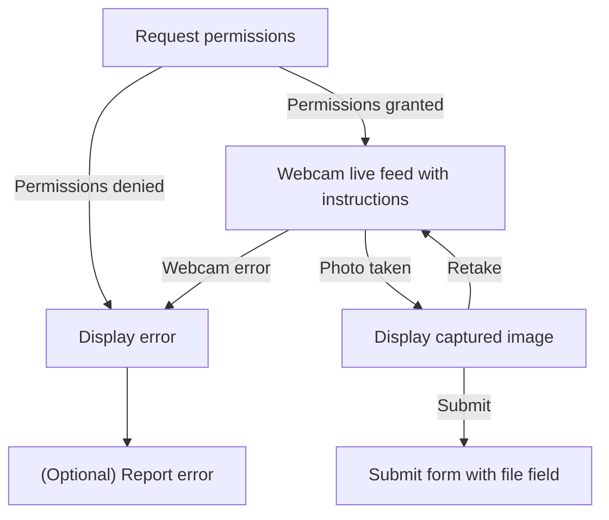
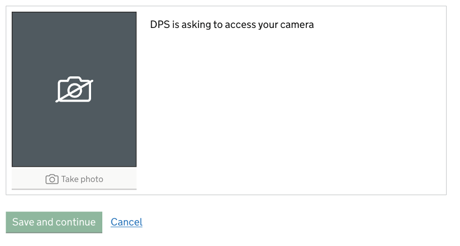
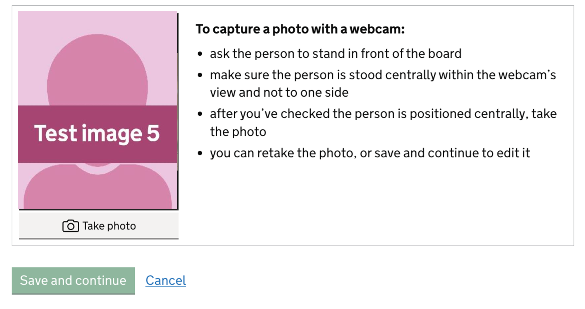
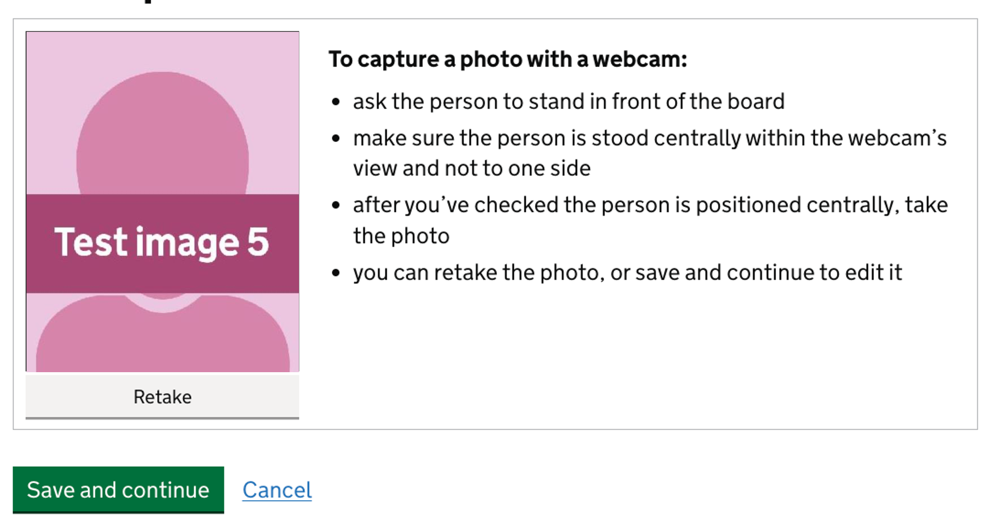
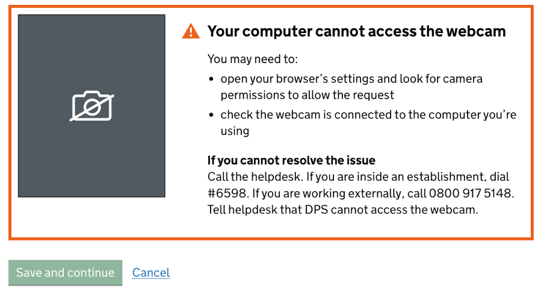

[< Back](../../../README.md)
---

# Webcam Capture

Will output a set of divs with varying visibility that enable the use of the webcam capture flow below.



## Output

Request permissions:



Webcam live feed with instructions



Captured image



Error state



Error reporting (optional):

A GET request is sent to the URL `/api/report-error?pageUrl={ENCODED_PAGE_URL}&error={ERROR_NAME}`.

## Usage
```javascript
  
```

```javascript
    {{ hmppsWebcamCapture(
      {
        cancelUrl: "/prisoner/image",
        photoInstructions: { html: "<div>Example</div>" },
        fileName: "profile-webcam-image",
        fileField: { name: "exampleFieldName" },
        reportErrors: true
      }
    ) }}
```

<details>
  <summary>Nunjucks macro options</summary><br>
  <table>
    <tr>
      <th>Name</th>
      <th>Type</th>
      <th>Description</th>
    </tr>
    <tr>
      <td><b>cancelUrl</b></td>
      <td>string</td>
      <td>The URL for the cancel link to use.</td>
    </tr>
    <tr>
      <td><b>photoInstructions.html</b></td>
      <td>html</td>
      <td>
        The HTML to be displayed to the right of the photo during the live feed & displaying captured image state.
      </td>
    </tr>
    <tr>
      <td><b>fileName</b></td>
      <td>string</td>
      <td>
        Optional - The name to be given to the generated file that gets submitted (default: "webcam-capture")
      </td>
    </tr>
    <tr>
      <td><b>fileField.name</b></td>
      <td>string</td>
      <td>Optional - The name of the input field the file is saved to (default: "file")</td>
    </tr>
    <tr>
      <td><b>fileField.name</b></td>
      <td>string</td>
      <td>
        Optional - Whether to report errors by sending a request to the
        <code>/api/report-error</code> endpoint.
        This requires the endpoint to be defined on your application.
        (default: false)
      </td>
    </tr>
  </table>
</details>
